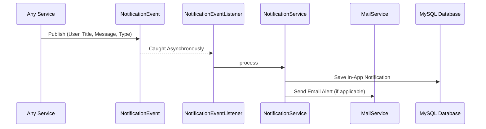

# Notification Module Documentation

## Overview
The Notification Module is a robust, asynchronous, and event-driven system designed to handle in-app and email communications within the Job Portal. It follows a decoupled architecture using Spring Events to ensure high performance and maintainability.

---

## Architecture & Flow
The module operates on a **Producer-Consumer** pattern:

1.  **Producer**: Any service in the application (e.g., `JobSeekerService`) can publish a `NotificationEvent`.
2.  **Event Bus**: Spring's `ApplicationEventPublisher` routes the event to registered listeners.
3.  **Consumer**: `NotificationEventListener` captures the event asynchronously using `@Async`.
4.  **Action**: The `NotificationService` persists the notification to the database and triggers the `MailService` for email dispatch.

### Flow Diagram


---

## API Reference

**Base URL**: `/api/v1/notifications`

| Method | Endpoint | Description | Auth Required |
| :--- | :--- | :--- | :--- |
| **GET** | `/api/v1/notifications` | Get all notifications for the logged-in user | Yes |
| **GET** | `/api/v1/notifications/unread-count` | Get count of unread notifications | Yes |
| **PATCH** | `/api/v1/notifications/{id}/read` | Mark a specific notification as read | Yes |
| **PATCH** | `/api/v1/notifications/read-all` | Mark all user notifications as read | Yes |
| **DELETE** | `/api/v1/notifications/{id}` | Permanently delete a notification | Yes |

---

## Notification Types (`NotificationType`)
*   `JOB_ALERT`: Notifications about new job matches.
*   `APPLICATION_STATUS`: Updates on job application progress (Shortlisted, Rejected, etc.).
*   `NEW_APPLICATION`: Alerts for employers when a candidate applies.
*   `WELCOME`: Initial greeting upon registration.
*   `SYSTEM`: Administrative or system-wide announcements.
*   `MESSAGE`: Direct messages between users.

---

## Configuration

### 1. Database
The module uses a `notifications` table. JPA automatically handles schema updates via:
```properties
spring.jpa.hibernate.ddl-auto=update
```

### 2. Email (SMTP)
Configure your mail server in `src/main/resources/application.properties`:
```properties
spring.mail.host=smtp.gmail.com
spring.mail.port=587
spring.mail.username=your-email@gmail.com
spring.mail.password=your-app-password
```

### 3. Asynchronous Processing
Enabled via `AsyncConfig.java` using `@EnableAsync`. This ensures that sending emails does not block the main application thread.

---

## Developer Guide: How to send a notification
To send a notification from any part of the application, simply inject `ApplicationEventPublisher` and publish the event:

```java
@Autowired
private ApplicationEventPublisher eventPublisher;

public void someAction(User user) {
    // ... business logic ...
    
    eventPublisher.publishEvent(new NotificationEvent(
        this, 
        user, 
        "Subject Title", 
        "The message content goes here.", 
        NotificationType.SYSTEM
    ));
}
```
